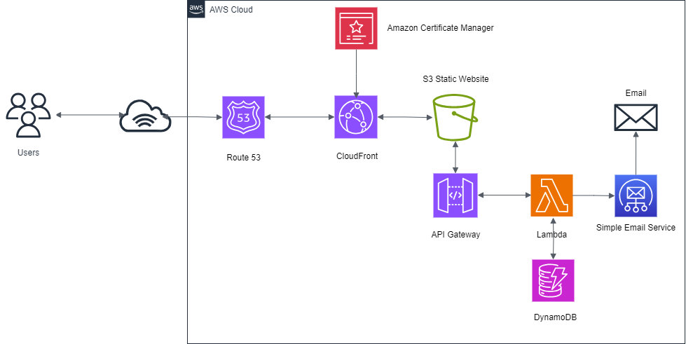

Cloud Resume Challenge - https://cloudresumechallenge.dev/docs/the-challenge/aws/  by Forrest Brazeal.

Build and launch online resume in the cloud using AWS, incorporating DevOps methods for efficient development and deployment.

**AWS Services:**
- Route53
- Cloudfront
- ACM
- S3
- API Gateway
- Lambda 
- SES
- DynamoDB

**Website:**
- HTML
- CSS
- Java Script
- template - https://themewagon.com/themes/free-one-page-bootstrap-4-html5-personal-portfolio-website-template-clark/

**Lambda:**
- Python

**Version Control**
- Github

**CI/CD**
- Github Actions Workflows

**IaC**
- Terraform

